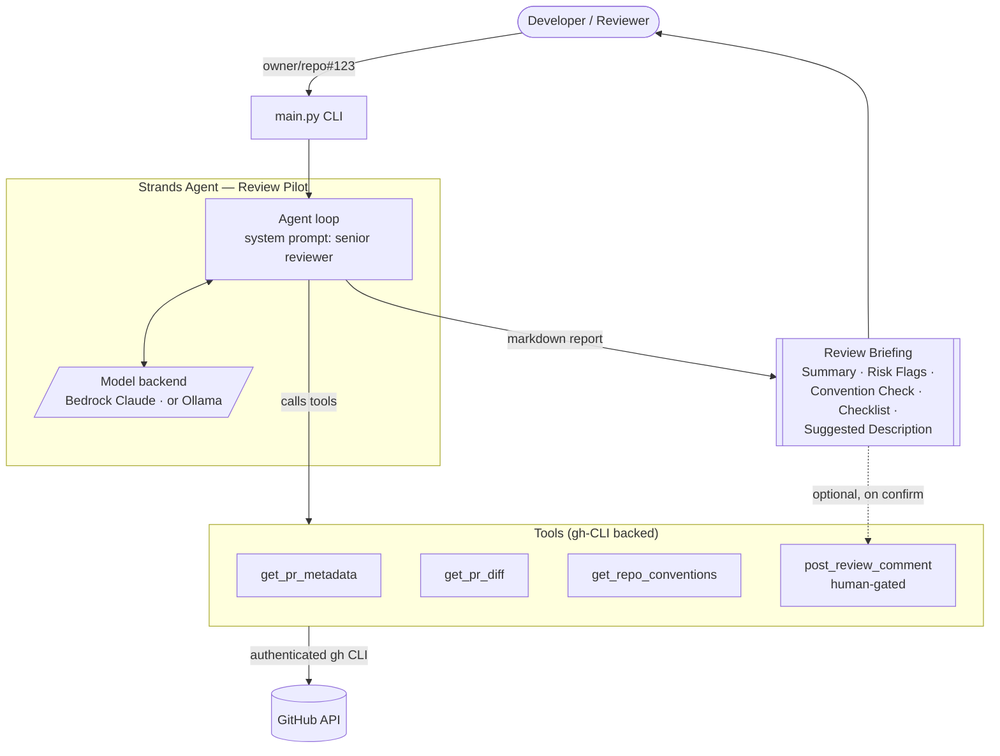

# Architecture — Review Pilot

Review Pilot has two stages: a deterministic gather step assembles the three context sources
every review needs, then a Strands agent reasons over that context to produce a reviewer
briefing. Gathering context in code (rather than leaving it to the model to remember) makes
the output reliable on any model backend. A human approves any write action.

## System diagram



## Flow

1. **Invoke** — the user passes a PR reference (`owner/repo#123` or a pull URL) to the CLI.
2. **Gather (deterministic)** — `gather_context()` fetches all three, in order:
   - `get_pr_metadata` — title, author, size, changed files
   - `get_pr_diff` — the actual unified diff (size-capped)
   - `get_repo_conventions` — the repo's own `CONTRIBUTING.md` / `CONVENTIONS.md` / `CLAUDE.md`
3. **Reason** — the model produces the five-section briefing, holding the diff to the repo's
   *own* conventions rather than generic style opinions.
4. **Human gate** — nothing is written back to GitHub unless the user runs `--post` and
   confirms; only then does `post_review_comment` run.

## Design decisions

- **`gh` CLI as the GitHub boundary.** The agent never touches raw tokens; auth is delegated to
  the user's existing `gh` login. Simple, secure, and works against any repo the user can see.
- **Deterministic gather, agentic reasoning.** The three context sources are fetched in code,
  not left to the model to remember to call. This guarantees every review is built from
  complete context and makes the output reliable even on small local models — while the tools
  stay registered so a strong backend can still be driven fully autonomously.
- **Model-agnostic backend.** One env var (`MODEL_BACKEND`) switches between Amazon Bedrock
  (production / hackathon) and Ollama (free local dev). No code changes.
- **Human-in-the-loop by design.** The agent *prepares* reviews; it never approves or merges.
  The only write tool is gated behind explicit confirmation in the CLI.
- **Context safety.** Diffs are truncated and file lists are trimmed so a huge PR can't blow the
  model's context window.

## Deployment (hackathon submission)

For the submission, the agent is packaged for **Amazon Bedrock AgentCore Runtime**:

```
main.py / CLI  ─────────────►  local dev & demo
                                
pr_review_agent.agent  ─────►  AgentCore Runtime entrypoint (cloud demo)
        │
        └── BedrockModel (Claude Sonnet 4.5, us-west-2)
```

AgentCore hosts the agent so the live demo runs in the cloud, strengthening the Technical
Implementation score. The same agent code runs in both places — only the entrypoint differs.
